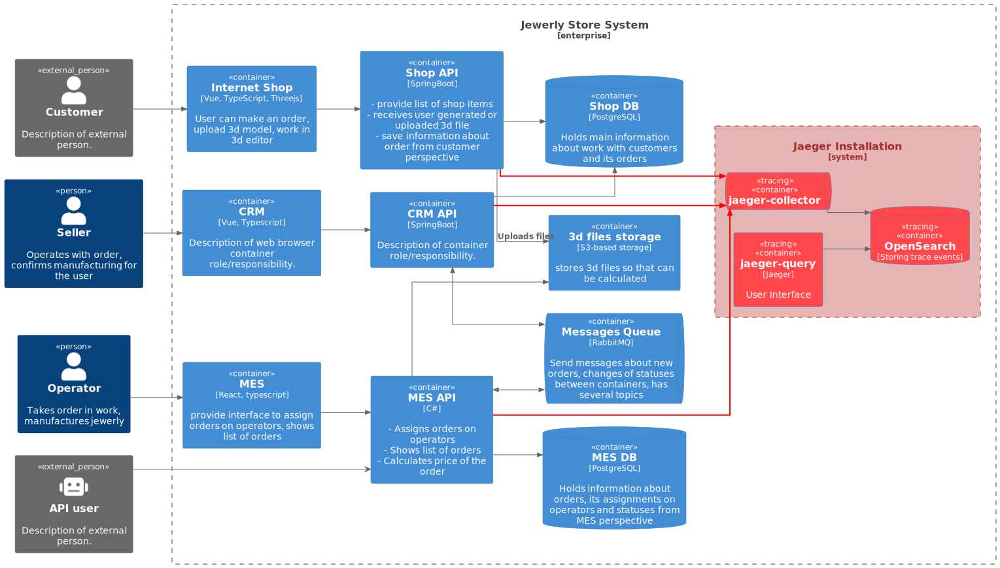

## Архитектурное решение по трейсингу

1. Проанализируйте систему компании и C4-диаграмму в контексте планирования трейсинга. Напишите и выделите на схеме системы, которые следует покрыть трейсингом. Для этого идентифицируйте места, где заказ может «сломаться» или зависнуть.

Составьте список данных, которые должны попадать в трейсинг.

## 1. Анализ

Трейсингом может быть покрыт каждый контейнер, включая фронтенд-приложения, сервера очередей и БД. 

В нашем случае следует собирать трейсы со всех API, поскольку именно в этих контейнерах происходят сложные преобразования данных, а также взаимодействия с внешними сервисами. Собирая данные из этих систем, мы заодно получим информацию об их взаимодействии с "соседями": запросы к БД, S3, RabbitMQ.

Таким образом в трейсинг должны попадать данные, относящиеся к вызовам процедур, включая параметры вызова, запросы к БД и сообщения в менеджере очереди.

Структура:

`trace_id`: уникальный идентификатор события  
`span_id`: уникальный идентификатор транзакции внутри события
`parent_span_id`: привязка к родительскому событию транзакции
`start_timestamp`: время начала 
`end_timestamp`: время окончания
`status`: статус транзакции

Собираемые данные:

- идентификатор заказа
- статус заказа
- http-запрос с параметрами
- http-ответ от сервера
- исключение (если есть)
- запрос в базу данных (если применимо)
- запрос в rabbitmq (если применимо)
- параметры (размер, формат) обрабатываемого файла модели (если применимо) 
- стек вызова
- имя ноды
- имя окружения

## 2. Мотивация

Трейсинг - мощный инструмент, направленный на глубокий поиск проблемы в распределенной системе. Он позволит отследить путь заказа в системе, проблемы с их потерей и низкую производительность.

Метрики:

- среднее время выполнения заказа
- показатели удовлетворенности клиентов
- количество обращений в поддержку
- Mean Time To Detect 
- Mean Time To Repair
- Latency
- Time To Market

## 3. Предлагаемое решение

В качестве инструмента для трейсинга выбран `Jaeger`, имеющий все необходимые средства для реализации.

События из приложения принимает `jaeger-collector`, который через `Kafka`, использующуюся в качестве буфера, отправляет их в `Opensearch`. Пользователи извлекают данные из БД, используя интерфейс `jaeger-query`.

Со стороны приложений требуется доработка путем инструментации кода библиотеками OpenTelemetry и разворачиванием `jaeger-agent`, которые собирают трейсы из приложений и отправляют их в коллектор.

## 4. Компромиссы

- не покрывает инфраструктурные сервисы. 
- требуется доработка кода
- дополнительный объем данных при хранении, обработке и передаче потребует вложений
- требуется время и практика по освоению приемов работы с новым инструментом

## 5. Аспекты безопасности

1. Настройка авторизации и ролевой модели доступа.
2. Использование шифрования трафика при передаче.
3. Ограничение доступа к сервису хранения данных (Opensearch)
4. Логирование и аудит событий доступа к компонентам системы трейсинга
5. Токенизация, анонимизация чувстительных данных в трейсах