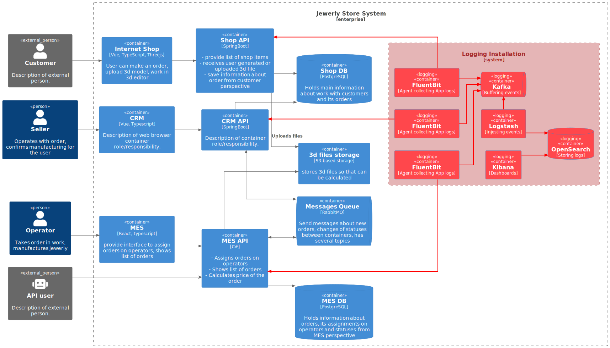

## Архитектурное решение по логированию

### 1. Анализ информации для сбора

Опишите, какие логи нужно собирать, и отметьте на схеме, из каких систем требуется сбор логов. Составьте список необходимых логов с уровнем INFO. 

| Application | Event                              | Fields                                                        | Level |
| ----------- | ---------------------------------- | ------------------------------------------------------------- | ----- |
| Для всех    | Изменение статуса заказа           | \- timestamp \- clientid \- orderid \- status     | INFO  |
| Для всех    | Запуск и остановка приложения      | \- timestamp \- eventid \- description                  | INFO  |
| Для всех    | События доступа в систему          | \- timestamp \- eventid \- username                     | INFO  |
| Shop API    | Загрузка файла                     | \- timestamp \- clientid \- orderid \- file_metadata | INFO  |
| MES API     | Изменение статуса обработки модели | \- timestamp \- orderid \- status                       | INFO  |
| MES API     | Загрузка файла                     | \- timestamp \- orderid \- file_metadata                | INFO  |

Предполагается использование дополнительных уровней логирования:

- `WARN` включает в себя информирование о, например, повторных попытках обращения в смежные сервисы, или медленные ответы из него
- `ERROR` включает в себя все ошибки из приложения
- `DEBUG` включает в себя отладочную информацию. Например, все http-запросы к приложению

Уровни логирования `WARN` и `ERROR` включены в уровень `INFO`.  
Уровень `DEBUG` включается временно по запросу для сбора дополнительной информации при отладке приложения, либо на nonprod окружениях.

### 2. Мотивация

Логирование повышает информированность о системе. Поскольку все программы генерируют логи, то централизованный сбор логов - это самый простой способ заглянуть внутрь всей системы, связать события из одного приложения с проблемами, возникающими в другом. 

Метрики, на которые влияет логгинг:

- среднее время выполнения заказа
- показатели удовлетворенности клиентов
- количество обращений в поддержку
- улучшение безопасности (audit logging)
- Mean Time To Detect 
- Mean Time To Repair
- Time To Market

Логгирование в первую очередь следует внедрить в ключевые системы: `MES`, `CRM API` и `RabbitMQ`, поскольку именно между этими системами происходит основное взаимодействие, и именно эти системы наиболее загружены.

### 3. Предлагаемое решение

В качестве решения выбран стек `ELK`, являющийся отраслевым стандартом. Данное решение работает следующим образом:

1. На ноды устанавливается коллектор логов `fluentbit`, который занимается чтением логов, их форматированием в json и пересылкой в очередь `kafka`
2. `kafka` выступает в качестве буфера для временного хранения необработанных событий
3. Записи из очереди `kafka` вычитывает `logstash`, анонимизирует/токенизирует/фильтрует данные в определенных полях, а затем отправляет записи в индексы `opensearch` по типам событий.
4. `Opensearch` является хранилищем данных, позволяющим управлять ими и выполнять к ним пользовательские запросы.
5. Доступ к хранилищу осуществляется через `kibana`, представляющий из себе инструмент выполнения запросов и построения диаграм.

На схеме показан сбор логов только из приложений, однако в систему сбора можно также интегрировать и инфраструктурные сервисы.

События разных типов хранятся в разных индексах в зависимости от назначения.

Доступ к разным типам индексов выдается на основе RBAC:

- `devops` - доступ к логам инфраструктуры
- `developer` - доступ к логам приложений
- `security` - доступ к логам аудита

События доступа логируются.

Политика обработки индексов устанавливает следующие правила:

1. Новые индексы создаются каждый день;
2. Индексы хранятся
    - не более 60 дней для индексов общего назначения
    - не более 365 дней для индексов событий аудита
3. Индексы старше 7 дней переносятся в холодное хранилище

### 4. Система анализа логов

1. Выделяются ключевые события, требующие внимания
    - рестарт приложения
    - hardware failure
    - удачное событие входа в административную панель из другого региона
2. Событиям назначается уровень приоритета
3. Настраивается триггер на возникновение такого события.

4. Собранные логи аггрегируются для превращения их в метрики, которые через мониторинг собрать невозможно.
5. По собранным агреггированным метрикам также настраивается алертинг.
    Пример: 
    - CRM генерирует предупреждение о неудачной попытке доступа к внешнему серверу в рамках интеграции с сервисом доставки. Само событие некритичное, поскольку такая ситуация предусмотрена логикой работы, и сервис повторит запрос позже. Однако большое количество таких событий необходимо отслеживать, поскольку это является признаком проблемы.
    - определяются пороговые значения для величин запросов к API. При превышении таких запросов генерируется алерт, поскольку это может быть вызвано попыткой DDoS.

По мере внедрения систем агрегированные метрики на основе логов следует собирать напрямую в сервисе мониторинга.