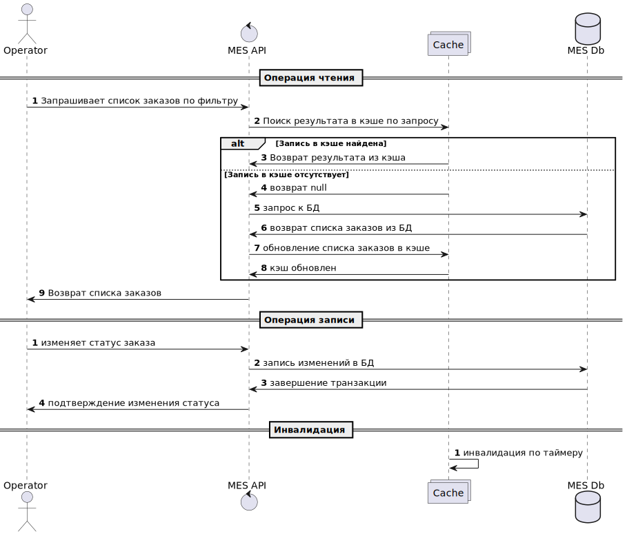

## Архитектурное решение по кешированию

### 1. Анализ 

> Участились жалобы от операторов: когда они заходят на первую страницу MES, система долго прогружается. На первой странице отображается список заказов в работе по статусам — это дашборд с фильтром. Раньше страница показывала все заказы, но это тормозило загрузку. Команда сделала фильтр по статусам и пагинацию, но это не помогло. Операторам важно видеть самые новые заказы, потому что от этого зависит их вознаграждение, — кто взял заказ, тот и получит оплату.

В этой ситуации необходимо проанализировать путь прохождения всего запроса от бразуера пользователя до БД и обратно, обращая внимание на время прохождения каждого этапа. Предлагать мероприятия следует, имея на руках результаты такого анализа.


### 2. Мотивация

Кэширование призвано решить следующие проблемы:

1. Уменьшение времени загрузки статического контента страницы 
1. Уменьшение времени загрузки данных из БД


### 3. Предлагаемое решение


1. Статический контент страницы следует кэшировать на стороне клиента с помощью следующего заголовка:

    ```
    Cache-Control: private, max-age=0, no-cache
    ```


1. При внедрении серверного кэширования необходимо учитывать паттерн нагрузки и характер возвращаемых результатов. В нашем случае требуется кэшировать _операции чтения_, когда сервер возвращает _часто изменяемые_ данные. 

    Возможные паттерны:

    | Паттерн                    | Принцип работы                                                                                                                 | Плюсы                                                                                                                                                        | Минусы                                                                                                       |
    | -------------------------- | ------------------------------------------------------------------------------------------------------------------------------ | ------------------------------------------------------------------------------------------------------------------------------------------------------------ | ------------------------------------------------------------------------------------------------------------ |
    | Cache-Aside                | Сервис запрашивает запись из кэша, если ее там нет или она устарела, или кэш недоступен, то обращается к БД и обновляет кэш.   | \- является самым простым для реализации<br>\- модель данных в кэше может быть трансформирована под нужды приложения<br>\- не страдает от недоступности кэша | \- первые запросы извлекаются из БД, минуя кэш, что приводит к задержкам<br>\- требует механизма инвалидации |
    | Write-Through+Read Through | При создании заказа данные пишутся в кэш и БД одновременно.<br>При чтении можно использовать совместно с паттерном Read-Through | \- паттерн заносит в кэш самые свежие записи, и именно они нужные на главной странице<br>\- данные консистентны: что находится в БД, то находится и в кэше   | \- дополнительные задержки на запись                                                                         |
    | Refresh-Ahead              | Принудительное обновление кэша наиболее часто запрашиваемыми данными                                                           | \- консистентный кэш                                                                                                                                         | \- поломка кэша приводит к полной неработоспособности страницы                                               |


    **Наиболее привлекательным выглядит внедрение Read-Aside стратегии** из-за простоты и широких возможностей настройки. Такую стратегию можно применить не только для первой страницы, но и для любых других фильтров. Недостатки в виде необходимости инвалидации кэша и cache-miss при первом запросе можно компенсировать принудительным "прогревом" кэша также, как это делается в стратегии Refresh-Ahead. 
    
### 4. Стратегии инвалидации кэша

| Типы инвалидации | временная инвалидация                                                             | инвалидация на запросах                                                                          | инвалидация на базе изменений                                                                                              | Программная инвалидация                                | Инвалидация по ключу                                 |
| ---------------- | --------------------------------------------------------------------------------- | ------------------------------------------------------------------------------------------------ | -------------------------------------------------------------------------------------------------------------------------- | ------------------------------------------------------ | ---------------------------------------------------- |
| Преимущества     | \- простота реализации<br>\- управляемые интервалы<br>\- предсказуемые результаты | \- можно добиться точной инвалидации                                                             | \- можно добиться консистентности                                                                                          | \- можно добиться любых результатов                    | \- точечная инвалидация каждого неактуального заказа |
| Недостатки       | \- при большом интервале может содержать неактуальные данные                      | \- нужно собрать слишком много информации для настройки, и постоянно следить за ее актуальностью | \- потребуется вносить изменения в процесс записи и изменения статуса заказов, и скорее всего менять стратегию кэширвоания | \- требуется глубокое понимание запросов пользователей | \- сложности в реализции                             |


### 5. Диаграмма последовательности действий


